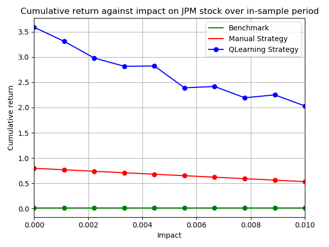

## Manual trading and Market simulation

### Overview

&emsp; In this project, we first need figure out the indicators for decision making and stock trading. Before taking this project, I have no idea how to trade stock, just randomly `long` or `short` stocks, without any technical analysis, this project gave me great experience how to analyze the stock and how to make decision based on the stocks performance. 

&emsp; The second part of the project, we use the Intuitive criterion, like `sharp ration > 0`, `simple moving average ration > 0` or `MACD < 0`, to make the **SHORT** or **LONG** decision. In this experiment, we tune the criterion to obtain **MAXIMUM** returns. This part is very time consuming, but helpful for us to understand the influence of each indicator on the final returns. As a warm-up for machine learning, Q-learning method, this part is a foundation and increase my interest to use Machine Learning technique to build agent to autonomously trade stocks.

### Part I Technical Indicators

&emsp; For this part, I will describe the indicators for the project. In trial and error procedures, I tried `Kalman Filter`, `sharp ratio`, `Moving Average Convergence Divergence(MACD)`, `Bollinger Band`, `simple moving average ratio`, `Bollinger Band percent`, and `Fourier Transformation`. the performance of Kalman filter can only tracking the increase of stocks, the stochastic influence of circumstance cannot be well predicted, the Bollinger Band Percent is a new concept that was proposed in 1990, but the performance of Bollinger Band Percent is still not satisfying for my case study. As a result, I end up with MACD, simple moving average ratio and Bollinger ratio to be the indicators. 

* 1.	Simple Moving Average
  &emsp; The Simple Moving Average (SMA) is a technical indicator for determining if an asset price will continue or reverse a bull or bear tread [1](https://www.investopedia.com/terms/s/sma.asp). SMA is calculated as the arithmetic average of an asset price, while Exponential Moving Average (EMA) that weight more on the recent price. The calculation of SMA is shown as following,

   

  where, n is the window represents how far we look back the data, $A_n$ is the data in our window.

  

  &emsp; In indicator pool, SMA_Ratio is a indicator for BUY or SELL signal. The naïve SMA_Ratio algorithm is that 

  _______________________________________________________________________________________________ 
   * Algorithm 1: 
      - Calculate: SMA(n)
      - Calculate: SMR_{ration} = \frac{p_x}{SMA(t)}
        - If  $ SMR_{ration} < 0.92$:   Action = LONG
        - If  $ SMR_{ration} > 1.92$:   Action = SHORT
        - else:   Action = Do Nothing
      - End
  _________________________________________________________________________________________ 
  
  This shows how SMA ratio works, but for the real indicators, we combine SMA, Bollinger band and MACD together 

  &emsp;The calculation of , $SMA_{Ratio}$ is relative handy in pandas dataframe, we use the rolling window moving average to calculate, the calculation result is as following, 

      
    <b> 
        Fig. 1 SMA and SMA ratio figure for the data from (2008,1,1) to (2009, 12,31) 
    </b>
     
     *The windows size n = 14 day in this figure. 
     

&emsp; As we can see in Fig 1., if we use Algorithm 1, the **BUY** and **SELL** signal is obvious. I analyze the correlation of SMA_Ratio and JP Morgan stocks price, their correlation is negative, that means the peak of SMA_Ratio can give us the lower stock value and we can **BUY** stock, as in the arrow region of the figure.

* 2. Bollinger bands
  &emsp; Bollinger Bands are the technical analysis tool developed by John Bollinger, which contains SMA, upper band and lower band, the calculation for upper band and lower band can be shown as following equations,
  $$BB_{top} = SMA + (2 * std_{sma})$$
  $$BB_{bottom} = SMA - (2 * std_{sma})$$
  $$BB_{ratio} = \frac{p(x)-SMA(t)}{2 * std(t)}$$

      
    <b> 
        Fig.2 Bollinger band ratio calculation 
    </b>

&emsp; For this experiment, we also use the window 14 days to calculate the Bollinger bands, as shown in Fig. 2. This calculation was offered by project description[(4)](https://www.wikipedia.org/), it give us vey good indication of BUY and SELL signal, the divergence can give use the BUY and SELL signal.
&emsp; For comparison, Bollinger band percent was also be used in the experiment, but its indication was not useful, as shown in Fig. 3, this indicator cannot give us good signal for my experiment study. As a result, I used Bollinger band ratio offered by project description.

<<<<<<< HEAD
      
=======
      
>>>>>>> 7aaba3c104f1c8ef6978fd264bc07cac401bf69e
    <b> 
        Fig.3 Bollinger band percent calculation
    </b>

* 3. Moving Average Convergence Divergence (MACD)
 &emsp; Based on exponentially weighted moving average, the calculation formula is shown as,
 $$ewa = \sum_{i=1}^{n}\frac{2}{N+1}(1- \frac{2}{N+1})^{i}x_{i-1} $$
 &emsp;  There has three lines in MACD model, the first one is 12 day exponentially weighted moving average, 26 day exponentially weighted moving average, the difference is MACD line,
  $$MACD_{line} = ewa(p_t, window = 12) - ewa(p_t, window=26)$$
  $$MACD_{signal} = ewa(MACD_{line}, window=9)$$

   &emsp;  As a result, the divergence of MACD, which is the difference of 〖MACD〗_line and 〖MACD〗_signal, can be used as the indication for **BUY** and **SELL** signal.
   $$MACD_{divergence} = MACD_{line} - MACD_{signal}$$

   

      
    <b> 
        Fig.4 MACD calculation results
    </b>

### Part II Theoretically Optimal Strategy

&emsp; In this part, we introduce the naïve stock trading policy, we assume that we can see the future. As such, we use the JP Morgan data as the future stock data. If we daily return is larger than 0, then the action is LONG, if daily return is less than 0, then we SHORT the stock. In the experiment, the technical indicator is that, 
$$p(t) - p(t + 1) > 0 \rArr SHORT$$
$$P(t) - p(t + 1) <0 \rArr LONG$$

&emsp; For easy understanding, $p(t)-p(t+1)>0$ that means the stock price will decrease. $p(t)-p(t+1)<0$ that means the stock price will increase. 

      
    <b> 
        Fig.5 JP Morgan data from 2008-2009 calculation results
    </b>
     
     * The calculation result is standard deviation is small, because the moving window is 14 days. The cumulative return from the normalized value is 5.78 $.  
     

<b> Table 1. Statistic calculation table</b> 

<table> 
    <thead>
        <tr>
            <th align = "center"> Statistics Items</th>
            <th align = "center"> Theoretically Optimal</th>
            <th align = "center"> Brenchmark </th>
        </tr>
    </thead>
<tbody>
    <tr>
        <td align="center">Cumulative return</td>
        <td align="center">5.786</td>
        <td align="right"> 0.01229</td>
    </tr>
    <tr>
        <td align="center">Standard deviation of daily return</td>
        <td align="center">0.004547</td>
        <td align="right"> 0.01700</td>
    </tr>
    <tr>
        <td align="center">Mean of daily return</td>
        <td align="center">0.003816</td>
        <td align="right"> 0.000168</td>
    </tr>
</tbody>
</table>

### Part III Manual Strategy

&emsp; For the part, we ensemble the indicators from the Part II, because the theoretically optimal method cannot be feasible for the real stock trading, then we define a Manual strategy trading for the calculation, as following:
- If $MACD_{divergence}$ from Negative to Positive or Bollinger ratio <- 0.91 and  SMA_Ratio < 0.99:
  - This is **BUY** signal
- If $MACD_{divergence}$ from Positive to Negative or Bollinger ratio > 0.91 and  SMA_Ratio > 1.01:
  - This is **SELL** signal
- Otherwise, do NOTHING

<b> Table 2. Statistic calculation table</b> 

|   Statistics Items	|   Manual Strategy	|   Benchmark	| 
|:---:	|:---:	|:---:	|
|   Cumulative return	|   0.6615	|   0.0123	|  
|   Standard deviation of daily return	|   0.000783	|   0.0012	|  
|   Mean of daily return	|   0.00078	|   0.0012	|  

&emsp; The calculation plot is shown as following, 

      
    <b> 
        Fig.6 JP Morgan data from 2008-2009 calculation results
    </b>

### Part IV Comparative Analysis

&emsp; In this part we analysis the Manual strategy for the out sample data. We use JP Morgan data, the in sample data is from 2008-1-1 to 2009-12-31, and the out sample data is from 2010-1-1 to 2011-12-31.

&emsp; As we discussed before, when we use the in sample data has cumulative return 0.662, but for out sample data, we have 0.1655. we can see that the out sample data is not as good as in sample data for the calculation. This means the parameter of Bollinger band and SMA ratio criterionS for the in sample data works worse, but it is still useful for trading as we still earn money from this strategy. This has some sort of Machine Learning flavor, tunning the parameter and fit the data, but may not work well for out sample data . 

      
    <b> 
        Fig.7 JP Morgan data from 2010-2011 calculation results (out sample data)
    </b>

### Part V Reinforcement Learning

#### 1. Q-learning algorithm

&emsp; Model-free reinforcement learning algorithm , Q-learning, is used as the learning trader. It use the transition tuples $<s, a, r, s’>$, the goal of Q-learning is to learn a policy, which tells an agent what action to take under what circumstance. It does not require a model of environment, and it can handle problems with stochastic transitions and rewards, without requiring adaptations. The update equation is as followings,

$$Q^{new} (s_t,a_t )←(1-a)*Q(s_t,a_t )+a*(r_t+γ*max_{a}Q(s_(t+1),a))$$
$$ \prod{}{^*}(s) = argmax_aQ^{new}(s, a) $$

&emsp; Where $r_t$ is the reward, a is the learning rate, $\gamma$ is the discount factor.

- States:  For each three indicators, I use 10 bins to do data binning, number of state $10^3$
- Actions: The action for this calculation is that `LONG`, `SHORT`, `Do Nothing`. For the reinforcement learning algorithm, we use 0, 1, 2 to express action representatively.
- Rewards: As discuss, the daily return can facilitate the calculation and let the agent interact with the environment rapidly. For standardization, we use the equation of

$$ X_{scale} = \frac{X - u}{\sigma}$$

&emsp;The standardization can elimente the bias result from the different data scale for the machine learning model.

#### 2. Experiment analysis

 - Experiment analysis I
    &emsp;In the first experiment, performance of Q-learning strategy was analysis and compare it with bench and manual strategy. The data was JP Morgan data range from Jan 1, 2008 to December 31 2009. The benchmark is to start with 100,000$ cash and buy 1000 shares on the first day and short 1000 on the last day. The impact parameter is chosen as 0.005 for manual strategy and strategy learner. The result is shown as Fig. 5. 
    

      
    <b> 
        Fig.8 Comparison of different method for in sample data
    </b>

&emsp;As shown in Fig.8, the strategy learning works extremely good, the final normalized value is over 3.5. and the manual strategy can beat the benchmark at the end. However in the early stage, the manual strategy cannot beat the benchmark.
&emsp;Would you expect this relative result every time with in-sample data? Yes, for the development of Q-learning algorithm, we use the convergence check method, if the order table is constant, as such, the same training dataset will result in the relative results.

 - Experiment analysis II
&emsp;The metrics used for analysis the influence of impact to strategy learning is cumulative return and number of trades with different impact values. As we can see in Fig 6, with small impact value, the Q learning will get smaller influence on the performance, and the manual strategy linearly decrease with the increasing of impact.

&emsp; In Fig. 9, the change of impact has no effort on manual strategy, as well as Q-learning algorithm. Even the is a small fluctuation around 200, but the number of order still remain in a same number nearly 200.  As such, we can conclude that the impact will not or slight influence Number of orders.

<<<<<<< HEAD
     
    
=======
     
    
>>>>>>> 7aaba3c104f1c8ef6978fd264bc07cac401bf69e
     
    <b> 
        Fig.9 Comparison of different method for in sample data
    </b>

### Part VI Reference

* 1.	https://www.investopedia.com/terms/s/sma.asp
* 2.	https://www.tradingview.com/
* 3.	https://www.wikipedia.org/
